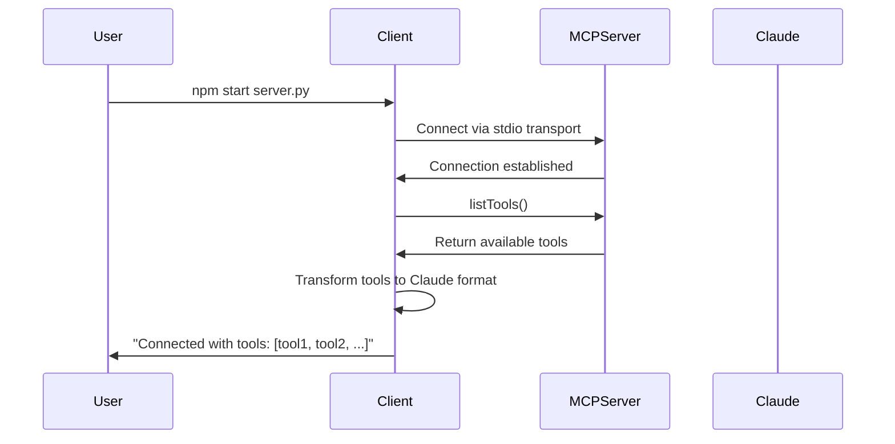
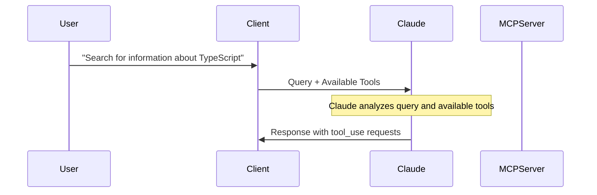
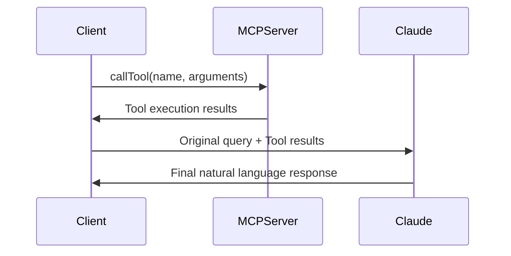

# How MCP Client Works

The MCP (Model Context Protocol) Client TypeScript implements a sophisticated bridge between Anthropic's Claude AI and external MCP servers. This document explains the technical details of how this integration works.

## Architecture Overview

The client operates as a middleware layer that:

1. **Connects** to MCP servers and discovers their available tools
2. **Translates** between Claude's tool format and MCP's protocol
3. **Orchestrates** the complex two-phase communication pattern required by MCP
4. **Manages** the conversation flow between user, Claude, and external tools

## Detailed Flow

### Phase 1: Initialization & Connection



**Technical Details:**

- Uses `StdioClientTransport` for communication with MCP servers
- Supports both Python (.py) and JavaScript (.js) server scripts
- Automatically detects the appropriate interpreter (python3, python, or node)
- Transforms MCP tool schemas into Anthropic's tool format

### Phase 2: Query Processing (Two-Phase Pattern)

When you submit a query, the client implements a sophisticated two-phase communication pattern:

#### Phase 2A: Initial Claude Request



**What happens:**

1. **Tool Context**: Your query is sent to Claude along with descriptions of all available MCP tools
2. **Claude's Decision**: Claude analyzes your query and decides which tools (if any) would be helpful
3. **Tool Selection**: Claude returns either:
   - Direct text response (no tools needed)
   - Tool use requests (tools required)

#### Phase 2B: Tool Execution & Final Response



**What happens:**

1. **Tool Execution**: If Claude requested tools, the client executes them via the MCP server
2. **Result Integration**: Tool results are added to the conversation context
3. **Final Processing**: Claude processes the tool results and generates a natural language response
4. **Response Delivery**: The final response (combining tool execution logs and Claude's analysis) is returned

## Key Technical Components

### 1. MCPClient Class

The main orchestrator that manages the entire workflow:

```typescript
class MCPClient {
  protected mcp: Client; // MCP SDK client
  protected anthropic: Anthropic; // Anthropic SDK client
  protected transport: StdioClientTransport | null; // Communication layer
  protected tools: Tool[]; // Available tools cache
}
```

### 2. Connection Management (`connection.ts`)

Handles the initial connection to MCP servers:

- **Transport Creation**: Establishes stdio-based communication
- **Tool Discovery**: Retrieves and caches available tools
- **Format Transformation**: Converts MCP tools to Anthropic format
- **Error Handling**: Manages connection failures gracefully

### 3. Query Processing (`handlers.ts`)

Implements the core two-phase pattern:

**Phase 1 - Initial Request:**

```typescript
const response = await this.anthropic.messages.create({
  model: process.env.ANTHROPIC_MODEL,
  messages: [{ role: "user", content: query }],
  tools: this.tools, // Key: Claude sees available tools
});
```

**Phase 2 - Tool Execution & Final Response:**

```typescript
if (content.type === "tool_use") {
  // Execute tool via MCP
  const result = await this.mcp.callTool({
    name: toolName,
    arguments: toolArgs,
  });

  // Add result to conversation context
  messages.push({
    role: "user",
    content: result.content as string,
  });

  // Get final response from Claude
  const followUpResponse = await this.anthropic.messages.create({
    model: process.env.ANTHROPIC_MODEL,
    messages, // Now includes tool results
  });
}
```

### 4. Interactive Interface (`chat-loop.ts`)

Provides the user interface:

- **Readline Integration**: Command-line input/output handling
- **Loop Management**: Continuous conversation until user quits
- **Response Display**: Formats and presents results to user

## Tool Format Translation

The client performs crucial format translation between MCP and Anthropic:

**MCP Tool Format:**

```json
{
  "name": "search",
  "description": "Search for information",
  "inputSchema": {
    "type": "object",
    "properties": {
      "query": { "type": "string" }
    }
  }
}
```

**Anthropic Tool Format:**

```json
{
  "name": "search",
  "description": "Search for information",
  "input_schema": {
    "type": "object",
    "properties": {
      "query": { "type": "string" }
    }
  }
}
```

## Error Handling & Resilience

The client implements comprehensive error handling:

1. **Connection Errors**: Graceful failure with clear error messages
2. **Tool Execution Errors**: Captures and reports MCP server errors
3. **API Errors**: Handles Anthropic API failures and rate limits
4. **Resource Cleanup**: Ensures proper cleanup of connections and processes

## Performance Considerations

- **Tool Caching**: Tools are discovered once and cached for the session
- **Connection Reuse**: Single persistent connection to MCP server
- **Efficient Serialization**: Minimal data transformation overhead
- **Streaming Support**: Ready for future streaming response implementation

## Security Features

- **Environment Variables**: API keys stored securely in environment
- **Input Validation**: Server script path validation
- **Sandboxed Execution**: MCP servers run in isolated processes
- **Error Sanitization**: Sensitive information filtered from error messages

This architecture enables seamless integration between Claude's natural language processing and the rich ecosystem of MCP servers, providing users with powerful tool-enhanced AI interactions.
